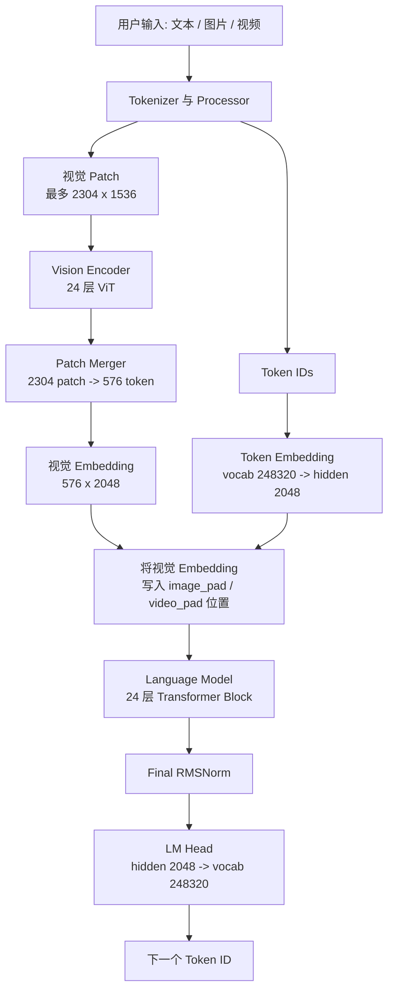
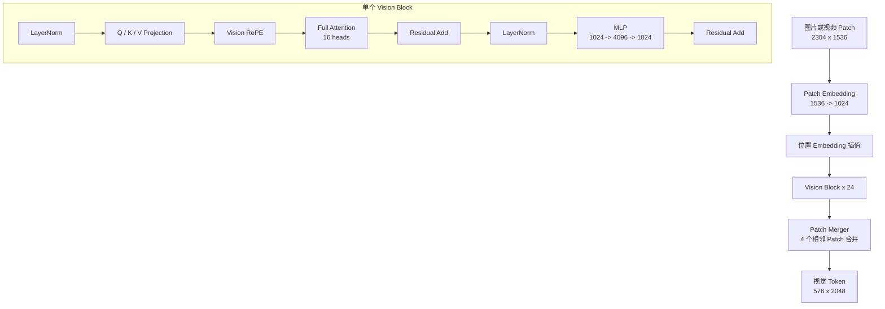
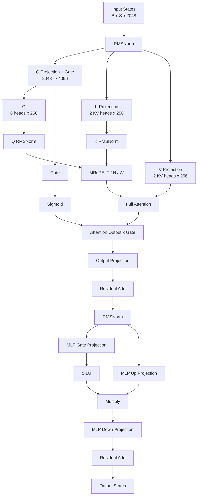
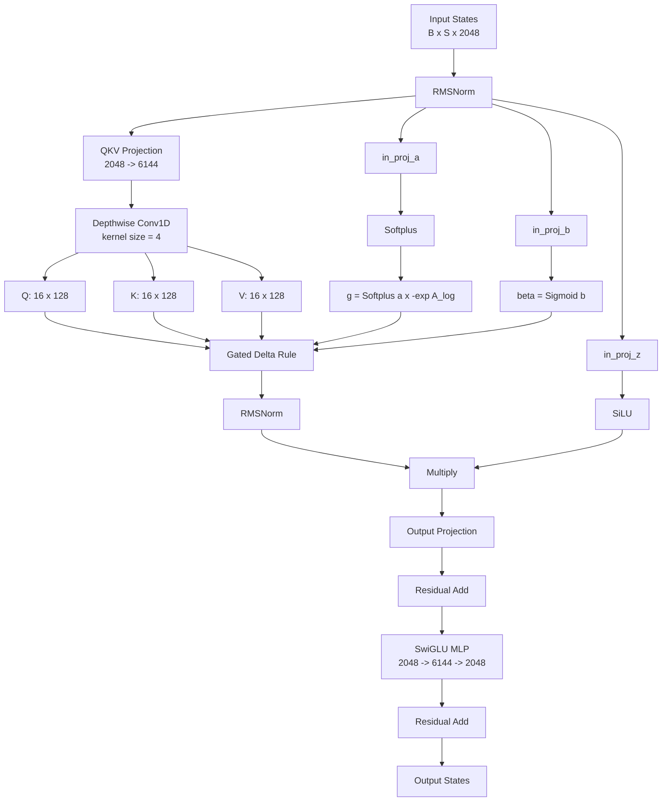
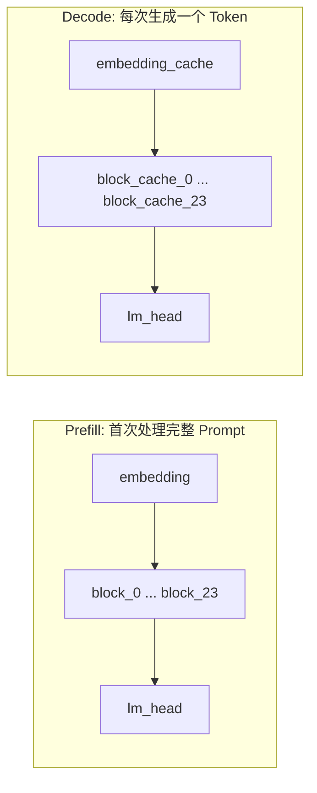

# Qwen3.5 LLM 从 Hugging Face 模型到 BModel 的转换流程

本文以 Qwen3.5-2B AutoRound INT4 模型为例，说明 `llm_convert.py` 如何读取
Hugging Face 模型目录、生成独立子网的 TOP MLIR、完成 BM1684X 后端编译，并将
局部 BModel 合并为最终可部署文件。

本文重点分析转换过程和中间产物，不讨论推理 Demo 的实现。

## 1. 示例命令与产物

示例转换命令：

```bash
llm_convert.py \
  -m /workspace/Qwen3.5-2B-int4-AutoRound \
  --max_input_length 1024 \
  -s 2048 \
  -c bm1684x \
  --max_pixels 768,768 \
  -o qwen3.5_2b
```

主要参数含义：

| 参数 | 示例值 | 作用 |
| --- | --- | --- |
| `-m` | `/workspace/Qwen3.5-2B-int4-AutoRound` | Hugging Face 模型目录 |
| `--max_input_length` | `1024` | Prefill 子网一次最多处理的 token 数 |
| `-s` | `2048` | 最大序列长度；标准注意力层据此创建 KV cache |
| `-c` | `bm1684x` | 目标 TPU 芯片 |
| `--max_pixels` | `768,768` | 视觉输入的最大高宽 |
| `-o` | `qwen3.5_2b` | 输出目录 |

本次转换的输出目录结构可以概括为：

```text
qwen3.5_2b/
├── config/
├── model.log
├── qwen3.5-2b-int4-autoround_w4bf16_seq2048_bm1684x_1dev_dynamic_<timestamp>.bmodel
└── qwen3.5-2b-int4-autoround_w4bf16_seq2048_bm1684x_1dev_dynamic/
    ├── vit/
    ├── embedding/
    ├── embedding_cache/
    ├── lm_head/
    ├── block_0/
    ├── ...
    ├── block_23/
    ├── block_cache_0/
    ├── ...
    └── block_cache_23/
```

顶层 `.bmodel` 是部署文件。较深一层的目录保存各个局部子网的 MLIR、局部
`.bmodel`、日志和调试上下文。

## 2. 总体流水线

完整转换过程如下：

```text
Hugging Face 模型目录
  │
  ├─ config.json
  ├─ tokenizer_config.json
  ├─ processor_config.json
  ├─ chat_template.jinja
  └─ model-*.safetensors
  │
  ▼
llm_convert.py
  │  读取 AutoConfig，选择 Qwen3_5Converter
  ▼
Qwen3_5Converter / LlmConverter
  │  读取 safetensors，整理量化权重
  │  按用途生成多个独立子网
  ▼
各子网 TOP MLIR + NPZ 权重
  │
  ▼
model_deploy.py
  │
  ├─ TOP MLIR -> TPU MLIR
  ├─ TPU MLIR -> final MLIR
  └─ final MLIR -> 局部 BModel
  │
  ▼
model_tool --combine
  │
  ▼
最终 BModel + model.log
```

Qwen3.5 并不是先导出一个完整的 Hugging Face 计算图，再自动切割成子网。
转换器根据模型结构显式构造每个子网的 MLIR 图。

## 3. Hugging Face 模型目录如何被读取

### 3.1 读取模型配置并选择 Converter

入口为 [`python/tools/llm_convert.py`](../../python/tools/llm_convert.py)。

首先通过 Transformers 加载配置：

```python
config = AutoConfig.from_pretrained(args.model_path, trust_remote_code=True)
```

随后根据 `config.model_type` 选择转换器。Qwen3.5 对应：

```python
(("qwen3_5", ), "llm.Qwen3_5Converter", "Qwen3_5Converter", {
    "force_dynamic": True,
    "pixel_multiple": 32
})
```

因此 Qwen3.5 会使用
[`python/llm/Qwen3_5Converter.py`](../../python/llm/Qwen3_5Converter.py)，并强制开启
动态 Prefill。视觉输入总像素数还必须是 `32 * 32` 的整数倍。

对于 `768 x 768` 输入：

```text
patch 数量 = (768 / 16) * (768 / 16) = 2304
视觉 merge 后 token 数 = 2304 / (2 * 2) = 576
```

### 3.2 读取 safetensors 权重

权重读取逻辑在 [`python/llm/LlmLoad.py`](../../python/llm/LlmLoad.py)。

转换器扫描模型目录中的 `.safetensors` 文件，使用 `safe_open()` 延迟访问各个
shard，再根据 tensor key 读取实际数据：

```python
with safe_open(file_path, framework="pt") as f:
    ...
tensor = f.get_tensor(key)
```

因此 `model.safetensors.index.json` 有助于理解分片映射，但不是当前转换器读取
权重的唯一入口。转换器会直接扫描 shard 文件。

### 3.3 复制运行时配置

[`LlmConverter.gen_config()`](../../python/llm/LlmConverter.py) 将模型目录中的
运行时配置复制到输出目录的 `config/`：

```text
config.json
generation_config.json
tokenizer.json
tokenizer_config.json
processor_config.json
chat_template.jinja
README.md
```

以下大文件不会被复制：

```text
*.safetensors
*.bin
*.pt
*.pth
model.safetensors.index.json
```

最终部署通常只需要顶层 `.bmodel` 和 `config/`。中间目录主要用于调试。

### 3.4 AutoRound INT4 权重

示例模型的 `quantization_config.json` 指定：

```text
bits = 4
group_size = 128
packing_format = auto_round:auto_gptq
sym = true
```

转换器将 `auto_round:auto_gptq` 识别为 GPTQ 风格打包，并读取：

```text
qweight
scales
qzeros
```

经过解包和重新排列后，量化线性层在 TOP MLIR 中表现为：

```text
top.A16MatMul
weight_bits = 4
q_group_size = 128
```

`A16` 表示激活采用较高精度，权重采用 INT4。后端 lowering 后，本例主要使用
BF16 激活，因此最终模式显示为 `W4BF16`。

线性注意力中的 `in_proj_a` 和 `in_proj_b` 被 AutoRound 配置保留为 FP16，不走
INT4 `A16MatMul`，而是生成普通 `MatMul`。

## 4. 子网如何生成

### 4.1 转换器的主流程

[`LlmConverter.run()`](../../python/llm/LlmConverter.py) 的主流程为：

```python
self.gen_config()
self.gen_all_mlir()
del self.model
self.compile_all()
```

其中：

1. `gen_config()` 复制配置文件。
2. `gen_all_mlir()` 生成各个子网的 TOP MLIR 和临时 NPZ 权重。
3. 删除模型加载器，释放原始权重占用的内存。
4. `compile_all()` 编译子网并合并局部 BModel。

### 4.2 Qwen3.5 的子网组成

本例包含：

| 子网 | 数量 | 用途 |
| --- | ---: | --- |
| `vit` | 1 | 图像 patch 编码和视觉特征提取 |
| `embedding` | 1 | Prefill token embedding |
| `embedding_cache` | 1 | Decode 单 token embedding |
| `block_N` | 24 | 第 N 层 Prefill |
| `block_cache_N` | 24 | 第 N 层逐 token Decode |
| `lm_head` | 1 | 根据最后一个 hidden state 选择输出 token |

因此最终 BModel 中共有 52 个 net：

```text
1 + 1 + 1 + 24 + 24 + 1 = 52
```

### 4.3 Qwen3.5 网络结构图

#### 4.3.1 整体结构



#### 4.3.2 语言模型层排列

24 层语言模型采用 `[Linear, Linear, Linear, Full] x 6` 的排列方式：


其中，Full Attention 层索引为：

```text
3, 7, 11, 15, 19, 23
```

#### 4.3.3 ViT 子网



#### 4.3.4 标准注意力层



#### 4.3.5 线性注意力层



#### 4.3.6 Prefill 与 Decode



两类语言模型层在两个阶段使用的核心算子和缓存不同：

| 层类型 | Prefill 算子 | Decode 算子 | 保存状态 |
| --- | --- | --- | --- |
| 标准注意力 | `FAttention` | `FAttention` | K/V Cache |
| 线性注意力 | `ChunkGatedDeltaRule` | `RecurrentGatedDeltaRule` | Conv State + Recurrent State |

### 4.4 MLIR 图如何构造

[`LlmConverter.gen_all_mlir()`](../../python/llm/LlmConverter.py) 收集生成任务，并用
线程池并行生成各层 MLIR。

MLIR 的底层构造辅助类为
[`python/transform/MLIRImporter.py`](../../python/transform/MLIRImporter.py)。它负责：

```text
创建 module
创建 main 函数
插入 top.Input
插入 top.Weight
插入 return
序列化 MLIR 文本
```

权重不直接写入 MLIR 文本，而是保存到对应 NPZ：

```text
block_10.mlir
../block_10_top_weights.npz
```

MLIR 中的 `top.Weight` 是 NPZ 权重引用。

## 5. Qwen3.5 的两类 Transformer 层

Qwen3.5-2B 有 24 层语言模型 block。其 `layer_types` 呈周期性分布：

```text
0   linear_attention
1   linear_attention
2   linear_attention
3   full_attention
4   linear_attention
...
23  full_attention
```

标准注意力位于：

```text
3, 7, 11, 15, 19, 23
```

其余 18 层为线性注意力。

[`Qwen3_5Converter.gen_block_mlir()`](../../python/llm/Qwen3_5Converter.py) 根据
`layer_types[idx]` 分派不同模板：

```python
if layer_types[idx] == "full_attention":
    self.gen_block_full_attn_mlir(idx)
elif layer_types[idx] == "linear_attention":
    self.gen_block_linear_attn_mlir(idx)
```

### 5.1 `block_10`：线性注意力 Prefill

`block_10/block_10.mlir` 的入口为：

```text
输入:
  input_states      [1, 1024, 2048]
  recurrent_states  [1, 16, 128, 128]

输出:
  output_states     [1, 1024, 2048]
  conv_states       [1, 6144, 4]
```

主要路径：

```text
input_states
  -> RMSNorm
  -> in_proj_qkv: 2048 -> 6144
  -> depthwise Conv1D, kernel = 4
  -> 拆分 Q/K/V，每组 [1, 1024, 16, 128]
  -> ChunkGatedDeltaRule, chunk_size = 64
  -> RMSNorm
  -> 与 in_proj_z gate 相乘
  -> out_proj
  -> 残差连接
  -> SwiGLU MLP
  -> 残差连接
```

Prefill 一次处理最多 1024 个 token，并建立：

```text
conv_states       [1, 6144, 4]
recurrent_states  [1, 16, 128, 128]
```

与标准注意力不同，线性注意力不会为每个历史 token 保存 K/V。

### 5.2 `block_cache_10`：线性注意力 Decode

`block_cache_10/block_cache_10.mlir` 的入口为：

```text
输入:
  input_states     [1, 1, 2048]
  conv_state       [1, 6144, 4]
  recurrent_state  [1, 16, 128, 128]

输出:
  output_states    [1, 1, 2048]
  conv_state       [1, 6144, 4]
```

主要路径：

```text
当前 token
  -> RMSNorm
  -> 生成当前 token 的 Q/K/V
  -> ConcatSlice 更新长度为 4 的卷积窗口
  -> ReduceSum 完成单 token Conv1D
  -> RecurrentGatedDeltaRule 更新 recurrent state
  -> 输出投影
  -> 残差连接
  -> SwiGLU MLP
  -> 残差连接
```

`recurrent_state` 由自定义 recurrent 算子原地更新，不作为显式返回值列出。

线性注意力 cache 子网编译时还会添加：

```text
--same_addr 0:0,1:1
```

该参数要求部分输入输出复用地址，减少逐 token Decode 时的内存搬运。

### 5.3 `block_3`：标准注意力 Prefill

`block_3` 使用 full attention。其主要路径为：

```text
input_states
  -> RMSNorm
  -> Q/K/V 投影
  -> MRoPE
  -> FAttention
  -> 输出 hidden states
  -> 输出当前层 K cache 和 V cache
  -> MLP
```

标准注意力层的 head 配置为：

```text
hidden_size = 2048
num_attention_heads = 8
num_key_value_heads = 2
head_dim = 256
```

### 5.4 `block_cache_3`：标准注意力 Decode

标准注意力的 Decode 子网接收：

```text
当前 token hidden state
position id
attention mask
历史 K cache
历史 V cache
```

对当前 token 计算新的 K/V，追加到历史 K/V 后调用 `FAttention`。当最大序列长度为
2048 时，attention mask 长度为：

```text
2048 + 1 = 2049
```

其中额外的 `1` 表示当前 token。

## 6. TOP MLIR 如何变成 TPU MLIR

### 6.1 每个子网独立调用 model_deploy.py

[`LlmConverter.compile_block()`](../../python/llm/LlmConverter.py) 为每个 Prefill block
构造独立任务：

```bash
model_deploy.py \
  --mlir block_10.mlir \
  --quantize w4bf16 \
  --q_group_size 128 \
  --quant_input \
  --quant_output \
  --chip bm1684x \
  --num_core 1 \
  --num_device 1 \
  --model block_10.bmodel \
  --addr_mode basic \
  --high_precision \
  --dynamic \
  --disable_gdma_check
```

所有子网任务由 GNU Parallel 并行执行。`block_cache_N` 的调用形式类似，但通常使用：

```text
--addr_mode io_alone
```

线性注意力 cache 子网还会添加 `--same_addr`。

### 6.2 TOP MLIR

Python 生成的初始 MLIR 属于 TOP 方言：

```text
module.state = "TOP_F32"
module.platform = "LLM_QUANTIZED"
```

以 `block_10.mlir` 为例，其中包含：

```text
top.RMSNorm
top.A16MatMul
top.Conv
top.ChunkGatedDeltaRule
top.Add
```

这一阶段主要表达模型语义，还没有完成 BM1684X 后端映射和地址分配。

### 6.3 TPU lowering

[`model_deploy.py`](../../python/tools/model_deploy.py) 的 `lowering()` 调用
[`mlir_lowering()`](../../python/utils/mlir_shell.py)：

```bash
tpuc-opt block_10.mlir \
  <lowering options> \
  -o block_10_bm1684x_w4bf16_tpu.mlir
```

得到：

```text
block_10_bm1684x_w4bf16_tpu.mlir
```

TPU MLIR 的模块属性变为：

```text
module.state = "TPU_LOWERED"
module.chip = "bm1684x"
module.mode = "W4BF16"
module.q_group_size = 128
```

主要变化：

| TOP MLIR | TPU MLIR |
| --- | --- |
| `top.A16MatMul` | `tpu.A16MatMul` |
| `top.Conv` | `tpu.Conv2D` |
| `top.SiLU` | `tpu.Active mode=SILU` |
| TOP 层 F32 张量 | 根据算子需要插入 BF16/F32 `tpu.Cast` |
| 抽象 INT4 参数 | 明确 INT4 weight、scale 和 zero point |

TOP MLIR 中看到 F32 接口并不表示最终 TPU 上所有计算都使用 F32。TPU lowering 会
根据 `W4BF16` 模式插入类型转换。

## 7. TPU MLIR 如何变成 final MLIR

### 7.1 后端优化和地址分配

[`mlir_to_model()`](../../python/utils/mlir_shell.py) 对 TPU MLIR 再调用一次
`tpuc-opt`：

```bash
tpuc-opt block_10_bm1684x_w4bf16_tpu.mlir \
  --mlir-disable-threading \
  --strip-io-quant \
  --processor-tpu-optimize \
  --dev-parallel \
  --weight-reorder \
  --subnet-divide="dynamic=True" \
  --op-reorder \
  --topo-sort \
  --layer-group \
  --affine-opt \
  --core-parallel \
  --after-layergroup-weight-reorder \
  --address-assign \
  -o block_10_bm1684x_w4bf16_final.mlir
```

实际参数可在每个子网调试目录的 `ref_files.json` 中查看。例如：

```text
block_10/block_10/ref_files.json
```

### 7.2 final MLIR

final MLIR 的模块属性为：

```text
module.state = "TPU_ADDRESSED"
```

该文件已经接近硬件执行计划，包含：

```text
权重地址
中间张量地址
输入输出地址
局部内存切片
Layer Group
Load / Store
流水阶段
动态子网信息
```

例如可以看到：

```text
module.coeff_addr
module.coeff_size
module.neuron_addr
module.neuron_size
tpu.Group
tpu.Load
tpu.Store
ginfo
```

`ginfo` 中的 `out_addr`、`buffer_addr`、`h_slice` 和 `stage` 等字段描述局部内存
调度和流水执行方式。

### 7.3 两份 final.mlir 的关系

子网目录中通常可以看到：

```text
block_10_bm1684x_w4bf16_final.mlir
block_10/final.mlir
```

前者是后端优化直接生成的 final MLIR。后者是 codegen 后复制到调试上下文目录的
副本，供调试器、profile 工具和 BModel 检查工具使用。两者内容相同。

## 8. final MLIR 如何变成 BModel

### 8.1 局部 BModel codegen

完成地址分配后，`mlir_to_model()` 第三次调用 `tpuc-opt`：

```bash
tpuc-opt block_10_bm1684x_w4bf16_final.mlir \
  --codegen="model_file=block_10.bmodel embed_debug_info=False model_version=latest bmodel_only=False gdma_check=False rvti=False" \
  -o /dev/null
```

得到：

```text
block_10/block_10.bmodel
```

每个子网都生成自己的局部 BModel。

### 8.2 合并局部 BModel

[`LlmConverter.compile_all()`](../../python/llm/LlmConverter.py) 完成所有子网编译后，
调用 `combine()`：

```bash
model_tool --combine \
  vit/vit.bmodel \
  embedding/embedding.bmodel \
  embedding_cache/embedding_cache.bmodel \
  block_0/block_0.bmodel \
  block_cache_0/block_cache_0.bmodel \
  ... \
  lm_head/lm_head.bmodel \
  -o <final>.bmodel
```

合并后的顶层 `.bmodel` 包含推理运行时可按名称调用的全部 net。

最后执行：

```bash
model_tool --info <final>.bmodel > ../model.log
```

因此 `model.log` 是最终 BModel 的结构摘要，不是模型转换过程的完整日志。

## 9. 子网目录中的常见文件

以 `block_10/` 为例：

```text
block_10/
├── block_10.mlir
├── block_10_bm1684x_w4bf16_tpu.mlir
├── block_10_bm1684x_w4bf16_final.mlir
├── block_10_bm1684x_w4bf16.layer_group_cache.json
├── block_10_bm1684x_w4bf16.layer_group_config.json
├── block_10.bmodel
├── block_10.bmodel.json
├── compiler_profile_0.txt
└── block_10/
    ├── final.mlir
    ├── ref_files.json
    └── .modify
```

各文件用途：

| 文件 | 用途 |
| --- | --- |
| `block_10.mlir` | Python 生成的 TOP MLIR |
| `*_tpu.mlir` | TPU lowering 后的 MLIR |
| `*_final.mlir` | 后端优化、Layer Group 和地址分配后的 MLIR |
| `*.layer_group_config.json` | Layer Group 搜索配置 |
| `*.layer_group_cache.json` | Layer Group 搜索结果缓存 |
| `block_10.bmodel` | 局部 BModel |
| `block_10.bmodel.json` | BModel 相关张量位置数据 |
| `block_10/final.mlir` | 调试上下文中的 final MLIR 副本 |
| `block_10/ref_files.json` | 关键文件、属性和实际命令记录 |
| `compiler_profile_0.txt` | 编译 profile 信息 |

当未启用 `--debug` 时，临时 NPZ 权重会在所有子网编译完成后删除。

## 10. model.log 中的 net 如何对应目录

最终 `model.log` 中列出的 net 与局部子网目录一一对应：

```text
vit
embedding
block_cache_0
...
block_cache_23
embedding_cache
lm_head
block_0
...
block_23
```

执行顺序通常分为：

```text
Prefill:
  embedding
  -> block_0 ... block_23
  -> lm_head

Decode:
  embedding_cache
  -> block_cache_0 ... block_cache_23
  -> lm_head
```

视觉输入存在时，先执行：

```text
vit
```

视觉特征随后与文本 embedding 按运行时逻辑组合。

## 11. 常见理解误区

### 11.1 TOP MLIR 中的 F32 不等于最终全部使用 F32

TOP MLIR 是高层表示。类型选择、BF16 转换和芯片算子映射发生在 TPU lowering
阶段。应结合 `*_tpu.mlir` 和 `*_final.mlir` 判断最终执行精度。

### 11.2 线性注意力层没有标准 KV cache

`block_cache_10` 保存固定大小的卷积状态和 recurrent state，而不是长度随上下文
增长的 K/V cache。因此其逐 token Decode 开销不会随历史长度线性增加。

### 11.3 tokenizer 中出现 audio token 不表示 BModel 支持音频塔

源模型 tokenizer 可能包含 `<|audio_pad|>` 等特殊 token。当前 Qwen3.5 转换器生成
的是文本和视觉子网，没有生成音频 encoder 子网。

### 11.4 config 中的原始视觉限制不等于已编译 BModel 的限制

输出 `config/processor_config.json` 来自 Hugging Face 模型目录。运行时仍需遵守转换
时设定的：

```text
--max_pixels 768,768
```

否则视觉 patch 数可能超过已编译 `vit` 子网的容量。

## 12. 排查转换结果时的阅读顺序

推荐按以下顺序阅读：

1. 查看顶层 `model.log`，确认最终 BModel 中有哪些 net、输入输出 shape 和内存占用。
2. 查看 `config/config.json`，确认层数、hidden size、注意力类型和量化配置。
3. 查看 `block_N.mlir`，理解 Python 构造的 TOP 计算图。
4. 查看 `*_tpu.mlir`，确认 BF16、INT4 和芯片算子映射。
5. 查看 `*_final.mlir`，分析 Layer Group、内存地址和动态子网。
6. 查看 `block_N/ref_files.json`，获得本次实际执行过的 `tpuc-opt` 命令。
7. 对照 `python/llm/Qwen3_5Converter.py`，理解该子网模板由哪段 Python 代码生成。

## 13. 关键源码索引

| 文件 | 作用 |
| --- | --- |
| [`python/tools/llm_convert.py`](../../python/tools/llm_convert.py) | 命令行入口、配置读取、Converter 分派 |
| [`python/llm/LlmLoad.py`](../../python/llm/LlmLoad.py) | safetensors 和 bin 权重读取 |
| [`python/llm/LlmConverter.py`](../../python/llm/LlmConverter.py) | 通用 LLM 子网生成、编译任务、BModel 合并 |
| [`python/llm/Qwen3_5Converter.py`](../../python/llm/Qwen3_5Converter.py) | Qwen3.5 ViT、线性注意力和标准注意力模板 |
| [`python/transform/MLIRImporter.py`](../../python/transform/MLIRImporter.py) | TOP MLIR 文本构造 |
| [`python/tools/model_deploy.py`](../../python/tools/model_deploy.py) | 单个子网的部署入口 |
| [`python/utils/mlir_shell.py`](../../python/utils/mlir_shell.py) | `tpuc-opt` lowering、优化、地址分配和 codegen 命令 |

